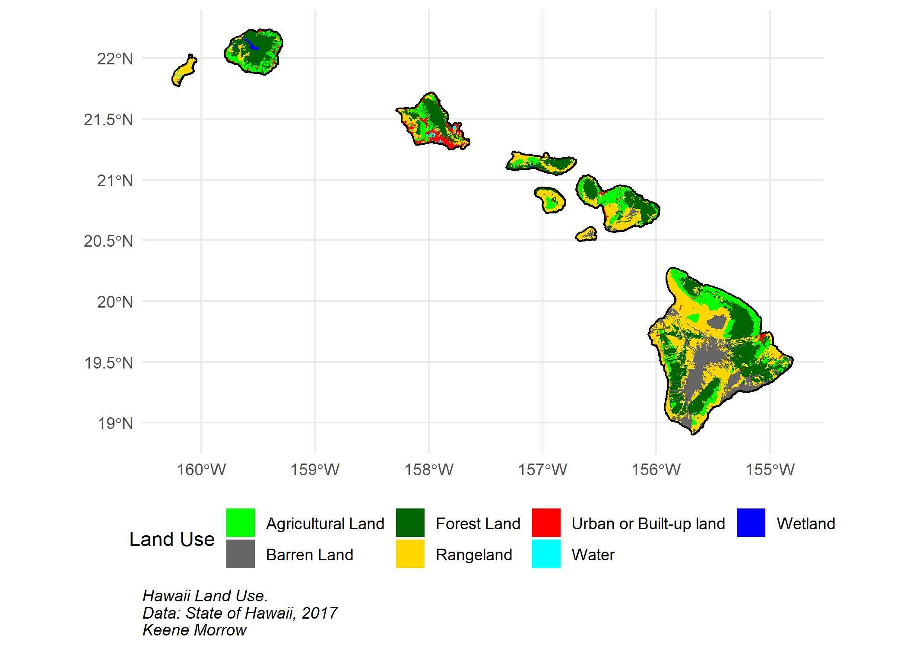
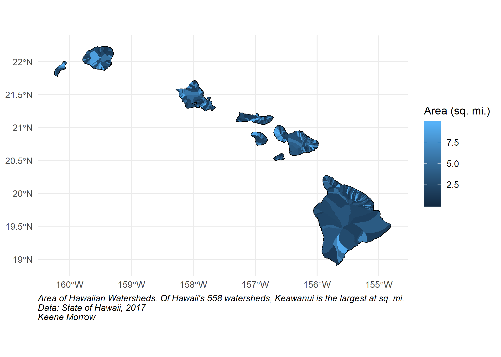
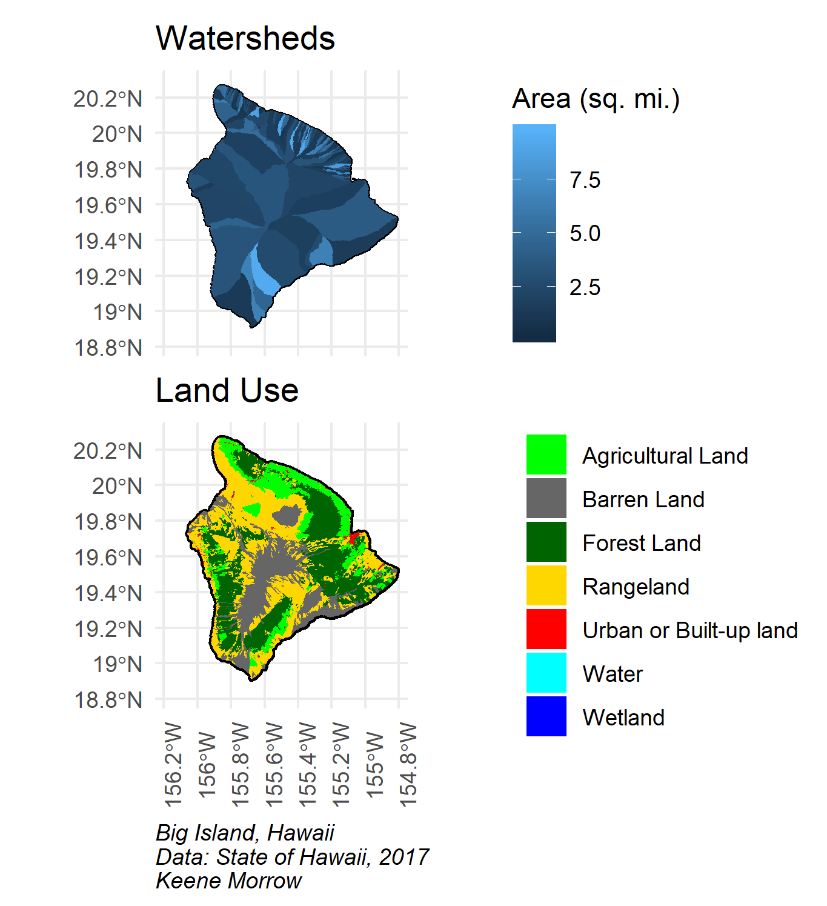

```{r setup, include = FALSE, warning = FALSE, message = FALSE, eval = FALSE}
knitr::opts_chunk$set(echo = TRUE, message = FALSE, warning = FALSE)

library(tidyverse)
library(here)
library(janitor)
library(raster)
library(sf)
library(tmap)
library(tmaptools)
library(naniar)
library(paletteer)
library(patchwork)
library(grid)
```


#### Land Use & Land Cover
```{r eval = FALSE}
land <- read_sf(dsn = here::here("data"),
                layer = "landuse")

land_simple <- land %>% 
  mutate(land_simple = case_when(landcover == "Residential" ~ "Urban or Built-up land",
                          landcover == "Commercial and Services" ~ "Urban or Built-up land",
                          landcover == "Industrial" ~ "Urban or Built-up land",
                          landcover == "Transportation, Communications and Utilities" ~ "Urban or Built-up land",
                          landcover == "Industrial and Commercial Complexes" ~ "Urban or Built-up land",
                          landcover == "Mixed Urban or Built-up Land" ~ "Urban or Built-up land",
                          landcover == "Other Urban or Built-up Land" ~ "Urban or Built-up land",
                          landcover == "Cropland and Pasture" ~ "Agricultural Land",
                          landcover == "Orchards, Groves, Vineyards, Nurseries and Ornamental Horticultural Areas" ~ "Agricultural Land",
                          landcover == "Confined Feeding Operations" ~ "Agricultural Land",
                          landcover == "Other Agricultural Land" ~ "Agricultural Land",
                          landcover == "Herbaceous Rangeland" ~ "Rangeland",
                          landcover == "Shrub and Brush Rangeland" ~ "Rangeland",
                          landcover == "Mixed Rangeland" ~ "Rangeland",
                          landcover == "Deciduous Forest Land" ~ "Forest Land",
                          landcover == "Evergreen Forest Land" ~ "Forest Land",
                          landcover == "Mixed Forest Land" ~ "Forest Land",
                          landcover == "Streams and Canals" ~ "Water",
                          landcover == "Lakes" ~ "Water",
                          landcover == "Reservoirs" ~ "Water",
                          landcover == "Bays and Estuaries" ~ "Water",
                          landcover == "Forested Wetland" ~ "Wetland",
                          landcover == "Nonforested Wetland" ~ "Wetland",
                          landcover == "Dry Salt Flats" ~ "Barren Land",
                          landcover == "Beaches" ~ "Barren Land",
                          landcover == "Sandy Areas Other than Beaches" ~ "Barren Land",
                          landcover == "Bare Exposed Rock" ~ "Barren Land",
                          landcover == "Strip Mines, Quarries, and Gravel Pits" ~ "Barren Land",
                          landcover == "Transitional Areas" ~ "Barren Land",
                          landcover == "Mixed Barren Land" ~ "Barren Land")) %>%
  drop_na(land_simple)

land_simple <- st_as_sf(land_simple)

hi_land <- ggplot() +
    geom_sf(data = land_simple,
          fill = NA,
          color = "black",
          size = 1,
          alpha = 0.5) +
  geom_sf(data = land_simple,
          aes(fill = land_simple),
          color = NA) +
  scale_fill_manual(values = c("green", "grey40", "dark green",  "gold", "red", "cyan", "blue")) +
  theme_minimal()

hi_land +
  labs(caption = "Hawaii Land Use.\nData: State of Hawaii, 2017\nKeene Morrow",
       fill = "Land Use") +
  theme(plot.caption = element_text(hjust = 0, face = "italic"),
        legend.position="bottom")

ggsave("hawaii_land.png", width = 7, height = 5)

```



#### Watersheds
```{r eval = FALSE}
water <- read_sf(dsn = here::here("data"),
                 layer = "watersheds")

hi_water <- ggplot(data = water) +
  geom_sf(fill = NA,
          color = "black") +
  geom_sf(aes(fill = area_sqmi),
          color = NA) +
  theme_minimal()

hi_water +
  labs(caption = "Area of Hawaiian Watersheds. Of Hawaii's 558 watersheds, Keawanui is the largest at sq. mi.\nData: State of Hawaii, 2017\nKeene Morrow",
       fill = "Area (sq. mi.)") +
  theme(plot.caption = element_text(hjust = 0, face = "italic"))

ggsave("hawaii_water.png", width = 7, height = 5)
```



#### Focus on the Big Island
```{r eval = FALSE}
big_water <- hi_water +
  coord_sf(xlim = c(-156.25, -154.75), ylim = c(18.75, 20.35), expand = FALSE) +
  labs(title = "Watersheds",
       fill = "Area (sq. mi.)") +
  theme(axis.text.x = element_blank(),
        legend.position = c(1.75, 0.5))

big_land <- hi_land +
  coord_sf(xlim = c(-156.25, -154.75), ylim = c(18.75, 20.35), expand = FALSE) +
  labs(title = "Land Use",
    fill = "") +
  theme(axis.text.x = element_text(angle = 90),
        legend.position = c(2.01, 0.5))

big_water / big_land +
  labs(caption = "Big Island, Hawaii\nData: State of Hawaii, 2017\nKeene Morrow") +
  theme(plot.caption = element_text(hjust = 0, face = "italic"),
        plot.margin = grid::unit(c(0,0,0,0), "mm"))
```

***

**Citations**

***

- Land Use Land Cover of Main Hawaiian Islands. Source: 1:100,000 1976 Digital GIRAS (Geographic Information Retrieval and Analysis). 2017. Hawaii Statewide GIS Program. http://geoportal.hawaii.gov/datasets/land-use-land-cover-lulc
- NASA. Image courtesy Jacques Descloitres, MODIS Land Rapid Response Team at NASA GSFC. (IotD Date: 2003-06-03. IotD ID: 15304)
- Surface Water Hyrdrologic Unit Boundaries (Watersheds) for the 8 major Hawaiian Islands.Source: GDSI, 1995, 1999; State of Hawaii Commission on Water Resource Management (CWRM), 2008.  Provided to State GIS, August, 2017. Hawaii Statewide GIS Program. http://geoportal.hawaii.gov/datasets/watersheds